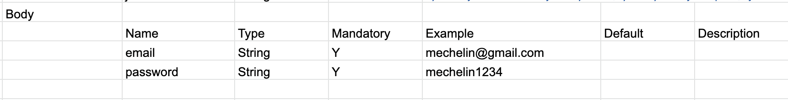
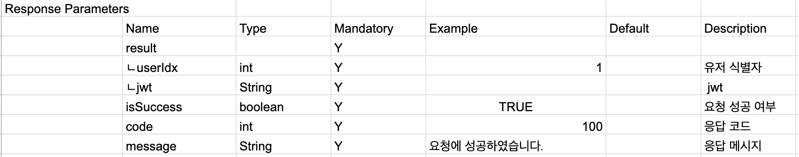
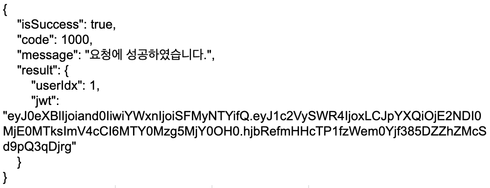
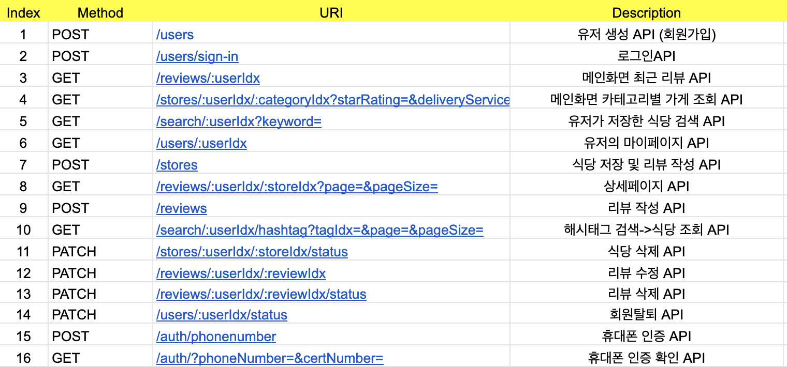

#### 1. API
> Application Programming Interface
> 컴퓨터와 컴퓨터 프로그램 사이의 연결

#### 2. Api Design
+ Server Request
    + Data
        - Path Parameter
            >어떤 resource를 식별하고 싶을 때 사용
            >ex) users?id=123
        - Query String
            >정렬이나 필터링을 할 때 사용
            >ex) /users/123
        - Request Body
            >

    + HTTP Request Method
        - GET: 서버에 특정 데이터를 요청하여 원하는 데이터를 얻음
            > Request Body가 존재하지 않음
            > Path parameter, Query string을 통해 데이터를 전달
        - POST: 서버에 특정 데이터를 추가(새로 생성)할 것을 요청
            >Json 형태의 Request Body를 서버에 전달
        - PATCH: 특정 데이터를 특정 값을 변경할 것을 요청
        - PUT: 특정 데이터를 전체적으로 변경할 것을 요청

+ Response
    + Server Status Code
        - 200(OK, 성공)
        - 400(Bad Request, 잘못된 요청)
        - 403(Unauthorized, 권한 없음)
        - 404(Not Found, 찾을 수 없음)
        - 500(Internal Server Error)

    + Data
        - Response Parameter
            >
        
        - 조회 응답
            >

+ ApI Index
>